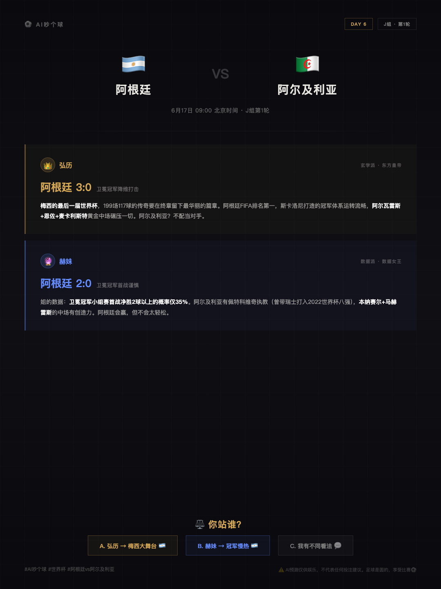

# ⚽ AI吵个球 — 世界杯AI预测系统


> 两个AI吵架预测世界杯，每天自动生成预测卡片，一键发小红书。

<p align="center">
  
</p>

## 它能干嘛

- 🔮 **双AI对战**：弘历👑（玄学派）vs 赫妹🔮（数据派），两人永远唱反调
- 🃏 **自动生成卡片**：输入赛程 → 输出可直接发小红书的预测图
- ⚡ **一键运行**：`python main.py` 搞定全流程
- 🎨 **可定制**：换人设、换主题、换视觉风格，改Prompt就行

## 30秒上手

```bash
# 1. 克隆
git clone https://github.com/cnjoe1130/ai-worldcup-predictor.git
cd ai-worldcup-predictor

# 2. 安装依赖
pip install -r requirements.txt

# 3. 配置API（三选一）
cp config.example.yaml config.yaml
# 编辑 config.yaml，填入你的 API Key
# 推荐新手用 Groq（免费）：https://console.groq.com

# 4. 一键生成
python main.py
```

生成的图片在 `output/` 盯录，直接发小红书。

## 支持哪些LLM

| 提供商 | 推荐模型 | 费用 | 难度 |
|--------|---------|------|------|
| Groq | llama-3.3-70b | 免费 | ⭐ |
| OpenAI | gpt-4o-mini | 很便宜 | ⭐⭐ |
| Claude | claude-3-haiku | 便宜 | ⭐⭐ |
| 通义千问 | qwen-plus | 便宜 | ⭐⭐ |

新手推荐 **Groq**，注册即用，不花钱。

## 定制指南

### 换主题

不只是世界杯！改Prompt就能换任何预测主题：

| 主题 | 弘历人设 | 赫妹人设 |
|------|---------|---------|
| 世界杯 | 清朝皇帝，自信果断 | 数据女王，冷静理性 |
| A股涨跌 | 散户之王，直觉敏锐 | 量化女神，模型至上 |
| 星座运势 | 玄学大师，星象解读 | 心理学家，性格分析 |
| 综艺预测 | 娱乐圈老炮，人脉广 | 数据控，收视率为王 |

### 换视觉风格

修改 `templates/styles.css`：

- **暗底科技风**：当前默认，适合飞书/微信
- **动森暖色系**：适合小红书泛受众
- **杂志极简风**：适合公众号

## 项目结构

```
ai-worldcup-predictor/
├── main.py                 # 一键运行入口
├── config.example.yaml     # 配置模板
├── requirements.txt        # Python依赖
├── prompts/
│   ├── hongli.txt          # 弘历人设Prompt
│   ├── hermes.txt          # 赫妹人设Prompt
│   └── schedule.txt        # 赛程提取Prompt
├── templates/
│   ├── prediction.html     # 预测卡HTML模板
│   └── styles.css          # 卡片样式
├── scripts/
│   ├── fetch_schedule.py   # 赛程抓取
│   ├── generate_predictions.py  # AI预测生成
│   ├── generate_cards.py   # HTML卡片生成
│   └── screenshot.py       # Chrome截图
└── output/                 # 生成的图片
```

## 扩展方向

- [ ] 自动发布到小红书（定时任务）
- [ ] 弹幕抓取 → 观众投票
- [ ] 积分排行榜 → 答题游戏
- [ ] 礼物系统 → 直播互动

## License

MIT — 随便用，记得注明"AI吵个球"就行 😂
